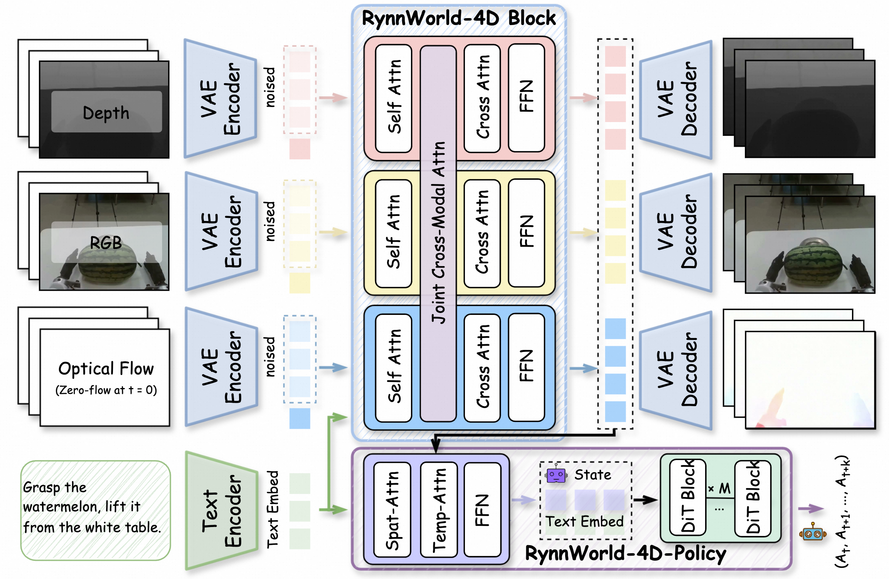

<div align="center">

## RynnWorld-4D: 4D Embodied World Models for Robotic Manipulation

</div>


<p align="center">
       💫 <a href="https://alibaba-damo-academy.github.io/RynnWorld-4D.github.io/"><b>Project Page</b></a>&nbsp;&nbsp; | &nbsp;&nbsp; 🤗 <a href ="https://huggingface.co/Alibaba-DAMO-Academy/RynnWorld-4D"><b> Hugging Face </b></a> &nbsp;&nbsp; | &nbsp;&nbsp; 🤖 <a href = "https://www.modelscope.cn/models/DAMO_Academy/RynnWorld-4D"><b> ModelScope</b></a>  &nbsp;| &nbsp;&nbsp; 📄 <a href="https://arxiv.org/abs/2607.06559"><b>arXiv</b></a>&nbsp;&nbsp;

</p>

---

## 🌟 Abstract

We present **RynnWorld-4D**, a novel 4D embodied world model that shifts the paradigm from 2D pixel prediction to physically grounded 4D scene evolution. By co-generating synchronized RGB, depth, and optical flow (RGB-DF), RynnWorld-4D captures the underlying 3D geometry and temporal motion trajectories, creating a representation space that effectively bridges the gap between generative world modeling and low-level robotic control. We release RynnWorld-4D as a unified diffusion framework featuring a specialized tri-branch architecture, alongside **RynnWorld-4D-Policy** (an inverse dynamics head for high-frequency, closed-loop bimanual manipulation).

<p align="center">
  
</p>

### 🌟 Key Highlights

- **Projective 4D Representation** — Integrates RGB, Depth, and Optical Flow into a unified RGB-DF format, allowing pixels to be unprojected into metric 3D scene flow for precise geometric and kinetic grounding.
- **Tri-branch Diffusion Architecture** — Employs three dedicated transformer branches with mutual cross-modal attention, ensuring that appearance, geometry, and motion evolve with high spatio-temporal consistency.
- **Action-from-Latent Policy** — RynnWorld-4D-Policy bypasses expensive multi-step denoising by directly consuming internal 4D latents, enabling high-frequency (9 Hz+), closed-loop dexterous control.

---

## 📰 News
* **[2026.07.08]**  🔥🔥 Release our <a href="https://arxiv.org/pdf/2607.06559">Technical Report</a> !!
* **[2026.07.07]**  🔥🔥 Release our code and model checkpoints!!

---

## 🚀 Quick Start

### 🔧 Environment Setup

We use anaconda or miniconda to manage the python environment:
```bash
conda create -n "rynnworld4d" python=3.10 -y
conda activate rynnworld4d
pip3 install torch torchvision --index-url https://download.pytorch.org/whl/cu121
pip install -r requirements.txt
pip install -e . --no-build-isolation
```

For the policy head (RynnWorld-4D-Policy), additionally:
```bash
cd rynnworld4d_policy && bash policy_env.sh && cd ..
```

### 📖 Pretrained Models

All pretrained models are placed under a single `pretrained/` directory:

```
RynnWorld-4D/
└── pretrained/
    ├── Wan2.2-TI2V-5B-Diffusers/       # base video backbone (required)
    ├── RynnWorld-4D/                    # our released stage-3 checkpoint (optional)
    └── da3/                             # Depth-Anything-3 (required for policy only)
```

**1️⃣ Wan2.2-TI2V-5B** — the required base backbone for world-model training and inference.
```bash
huggingface-cli download Wan-AI/Wan2.2-TI2V-5B-Diffusers --local-dir ./pretrained/Wan2.2-TI2V-5B-Diffusers
```

**2️⃣ RynnWorld-4D released weights** (optional) — skip training and directly run inference / policy.
```bash
huggingface-cli download Alibaba-DAMO-Academy/RynnWorld-4D --local-dir ./pretrained/RynnWorld-4D
```

**3️⃣  Depth-Anything-3** (only for `RynnWorld-4D-Policy`) — on-device depth estimation at policy inference time.
```bash
huggingface-cli download depth-anything/Depth-Anything-3 --local-dir ./pretrained/da3
```

All training/inference scripts derive `PROJECT_ROOT` from their own location and reference these paths relative to it, so no further path edits are needed.

---

## 🏋️ World-Model Training

The world model is trained in **3 stages**. All scripts resolve `${PROJECT_ROOT}` from `$BASH_SOURCE`, so cloning the repo anywhere works as long as `pretrained/Wan2.2-TI2V-5B-Diffusers` is in place. The bundled `data/sample.json` lets you smoke-test each stage immediately.

### 1️⃣ Stage 1 — SFT (all branches warm-up)
Full-parameter SFT on RGB, depth, and optical flow without Joint Cross-modal Attention.
```bash
bash scripts/rynnworld4d-stage1.sh
```
- `--training_type sft`, `--fusion_mode none`
- output → `training/rynnworld4d-stage1/`

### 2️⃣ Stage 2 — Tri-branch RoPE
Switch to 3D RoPE positional encoding. Joint cross-modal attention starts from `--joint_start_layer 0`.
```bash
bash scripts/rynnworld4d-stage2.sh
```
- `--resume_from_stage1 <stage1_ckpt>`
- output → `training/rynnworld4d-stage2/`

### 3️⃣ Stage 3 — Tri-branch SFT
Full-parameter fine-tuning with joint attention. A cosine decay schedule gradually reduces the depth/flow→RGB injection from 1.0 to 0.0 over `--joint_video_decay_steps`, preventing cross-modal interference from degrading RGB quality while preserving depth/flow consistency.
```bash
bash scripts/rynnworld4d-stage3.sh
```
- `--load_stage2_model_weights <stage2_ckpt>`, `--joint_video_decay True`
- output → `training/rynnworld4d-stage3/`

---

## 🎬 World-Model Inference

```bash
python inference-sft.py \
  --model_path ./pretrained/Wan2.2-TI2V-5B-Diffusers \
  --checkpoint_path ./training/rynnworld4d-stage3/checkpoint-1000 \
  --json_path ./data/sample.json \
  --output_dir ./results/inference-sft \
  --num_inference_steps 50 \
  --guidance_scale 1.0
```

Outputs the three synchronized streams per sample:
```
<output_dir>/<sample_id>/
├── rgb.mp4              # generated RGB
├── depth.mp4            # generated depth
└── flow.mp4             # generated optical flow
```

---

## 🤖 RynnWorld-4D-Policy (Bimanual Manipulation)

RynnWorld-4D-Policy reuses the frozen world-model backbone as a 4D feature extractor and trains a lightweight flow-matching action head on top.

### Bundled sample data
3 episodes of Tianji Pick-Place are shipped under `data/tianji_sample/` (head video + parquet + metadata) and `data/tianji_sample_depth/` (matching depth videos), so the policy trainer works immediately after clone.

### Train
```bash
bash scripts/rynnworld4d-policy.sh
```
Before launching, point `pretrained_model_path` (Wan2.2-TI2V-5B-Diffusers) and `rynnworld4d_ckpt` (your Stage-3 checkpoint) in `rynnworld4d_policy/policy_conf/train_config.yaml`.

The script auto-detects single vs multi-GPU and forwards extra args to `train.py` (Hydra-style):
```bash
# Override any config field on the CLI
bash scripts/rynnworld4d-policy.sh batch_size=4 max_epochs=100
```

### Serve / deploy
```bash
cd rynnworld4d_policy
python serve_rynnworld4d_policy.py --port 8099 --checkpoint <policy_ckpt>
```
The policy speaks the OpenPI websocket protocol; `smoke_test_serve.py` is a minimal client.

See [`rynnworld4d_policy/README.md`](rynnworld4d_policy/README.md) for the full policy training recipe and architectural details.

---

## 🙏 Acknowledgements & Third-Party Code

This project builds on several excellent open-source works, such as **[Depth-Anything-3](https://github.com/ByteDance-Seed/Depth-Anything-3)**, **[Video Prediction Policy (VPP)](https://github.com/roboterax/video-prediction-policy)**, **[Wan2.2-TI2V-5B](https://huggingface.co/Wan-AI/Wan2.2-TI2V-5B-Diffusers)**, and **[ptlflow](https://github.com/hmorimitsu/ptlflow)**. Vendored copies keep their original LICENSE alongside the source.


We thank the authors of these projects for making their work available.

---


## 📑 Citation

If you find this project useful, please cite:

```bibtex
@article{rynnworld4d,
  title  = {RynnWorld-4D: 4D Embodied World Models for Robotic Manipulation},
  author = {Haoyu Zhao and Xingyue Zhao and Siteng Huang and Xin Li and Deli Zhao and Zhongyu Li},
  journal= {arXiv preprint arXiv:2607.06559},
  year   = {2026},
}
```


---

## License

Apache License 2.0 — see [LICENSE](LICENSE) for details. Vendored third-party code is licensed under its respective upstream LICENSE, preserved in each `third_party/*/LICENSE` file.
